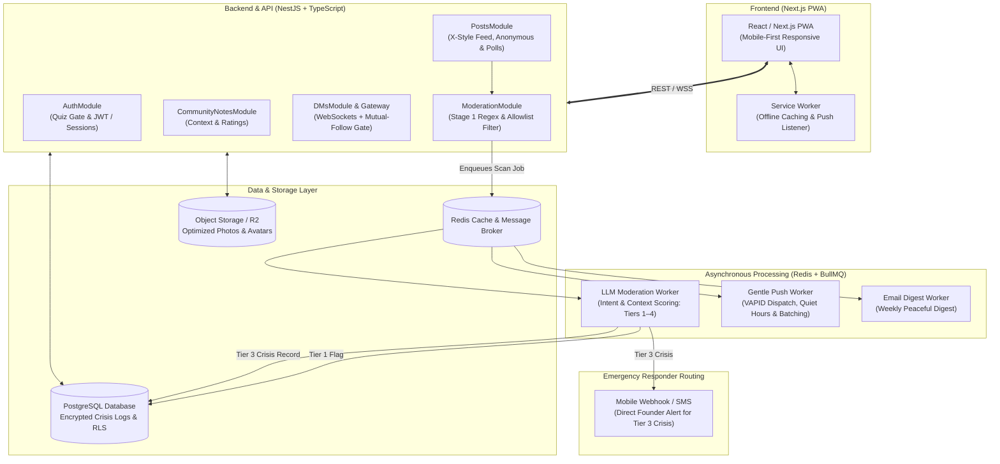

# Implementation Plan — Ease & Bloom MVP

A calm, privacy-focused, women-only progressive web application (PWA) built with **Next.js 14+** and **NestJS**, designed to transition the **Ease & Bloom** community from WhatsApp into an intentional sanctuary for women's mental, physical, and holistic wellness.

---

## User Review Required

> [!IMPORTANT]
> **Key Architecture Decisions Confirmed:**
> 1. **Core Technology Stack:** Next.js 14+ (App Router) + Tailwind CSS (PWA Frontend) + **NestJS (Modular TypeScript Backend)** + PostgreSQL / Prisma + Redis (BullMQ Queue) + Web Push API + Resend (Weekly Digest Emails).
> 2. **Context-Based Moderation Pipeline:** Replaces static blocklists with a **Hybrid 2-Stage Classifier** (Local clinical allowlist + low-latency contextual LLM evaluation) scoring across 4 categories (Harassment, Health Misinformation, Crisis Language, Predatory/Solicitation).
> 3. **Empathy-First Crisis Workflow (Tier 3):** Disclosures of self-harm, suicide, or abuse **stay visible** (never auto-deleted or slapped with public bot replies). Instead, an instant private mobile alert (SMS/WhatsApp webhook) notifies the on-call founder/responder to initiate a private, warm, "bestie-tone" check-in DM.
> 4. **Risk-Tiered Publishing:** Pre-publish server hold (<1.5s with optimistic UI) for high-risk spaces (Anonymous posts, Rant Room) vs. async post-publish background scanning for general community spaces.
> 5. **Crisis Log Privacy:** Tier 3 crisis records feature field-level encryption (AES-256), strict RBAC (accessible only to the Crisis Lead), and automated 60-day redaction/pruning.

---

## Technical System Architecture

---

## Phased Implementation Roadmap

### Phase 1: Foundation, Design System & PWA Scaffolding
* **1.1 Next.js Client Scaffolding:** Initialize Next.js 14+ with TypeScript, Tailwind CSS, and Lucide icons.
* **1.2 NestJS Backend Scaffolding:** Initialize modular NestJS backend with Prisma ORM, PostgreSQL connection, configuration management, and Swagger/OpenAPI docs.
* **1.3 Calm Design Language:** Implement theme tokens tailored for wellness (soft creams `#FAF7F5`, warm terracotta accents, muted rose, and comforting dark mode `#1A1817`).
* **1.4 PWA Manifest & Service Worker:** Setup `manifest.json`, icon assets, install prompts for iOS Safari & Android Chrome, and stale-while-revalidate offline caching.

---

### Phase 2: Authentication, Profile Setup & Soft-Gate Quiz
* **2.1 Auth Module (NestJS):** Secure registration, email/password login, JWT tokens with refresh mechanism.
* **2.2 "This-or-That" Soft CAPTCHA:** Interactive 3-question quiz gate during registration. Stores `quiz_verified = true` upon completion.
* **2.3 Profile Setup & Settings:** `@handle`, display name, avatar upload (compressed to WebP), bio, and user privacy toggles (Quiet Hours and DM permissions).

---

### Phase 3: Feeds, Topic Taxonomy & Content Creation (X-Style)
* **3.1 Topic Navigation:** Categorized topic pill bar (`#MentalHealth`, `#PhysicalHealth`, `#Wellness`, `#Motherhood`, `#AskTheCommunity`).
* **3.2 X-Style Post Card:** Compact, discussion-led post cards supporting text, attached photos, and tag pills.
* **3.3 Composer Modal:**
  * Rich text editor with photo upload.
  * **Anonymous Posting Toggle:** Masks author profile on the client, assigning a randomized pastel avatar and "Anonymous" badge.
  * **Content Warning (CW) Selector:** Blur overlay on posts tagged with sensitive topics (e.g., *Grief, Pregnancy Loss, Eating Disorders*).
  * **Interactive Polls & Q&A Cards:** Multi-choice polls with instant visual voting percentages.

---

### Phase 4: Contextual Moderation Pipeline & Crisis Workflow
* **4.1 Channel Risk Profiles:** Configure pre-publish hold (<1.5s with optimistic UI) for Anonymous Posts & Rant Room; async post-publish scanning for general feeds.
* **4.2 Stage 1 Local Guard (NestJS):** Fast in-memory check against the clinical allowlist (PCOS, endometriosis, miscarriage, depression) to eliminate false positives.
* **4.3 Stage 2 Contextual LLM Worker (BullMQ + Redis):**
  * Evaluates intent (first-person disclosure vs. targeted harm) and maps to **Tiers 1–4**.
  * **Tier 1:** Auto-hides post; routes to Moderator Queue.
  * **Tier 2:** Flags for 24h review; post remains visible.
  * **Tier 4:** Soft redirect note.
* **4.4 Tier 3 Crisis Escalation System:**
  * Post **remains visible** (no auto-deletion or public bot reply).
  * Dispatches high-priority mobile alert (SMS / WhatsApp webhook) to the on-call founder.
  * **1-Tap Empathetic DM:** Admin hub opens a direct message thread pre-populated with a warm, editable "bestie-tone" draft offering support and confidential resources.
* **4.5 Crisis Data Security:** AES-256 field encryption for crisis snippets, restricted access for `CRISIS_LEAD`, and 60-day auto-pruning cron job.

---

### Phase 5: Community Notes (X-Style Fact-Checking)
* **5.1 Note Proposal Modal:** Members can add context/fact-checks to health claims, selecting a classification category and attaching a reputable source URL.
* **5.2 Crowdsourced Rating Flow:** Community members rate pending notes (*Helpful, Somewhat Helpful, Not Helpful*) with reasoning tags (*Cites credible sources, Clear tone, Misleading*).
* **5.3 Consensus Callout Card:** Once a note reaches the required consensus threshold ($\ge 5$ ratings with $> 70\%$ approval), it renders publicly beneath the post as a verified **Community Context** card.

---

### Phase 6: Empathy Engagements & 1-on-1 Direct Messaging
* **6.1 Supportive Reactions:** Like / Heart + custom **"Send Hugs / Support (🤗)"** reaction.
* **6.2 Threaded Comments:** Nested discussions sorted by supportive feedback.
* **6.3 1-on-1 Realtime DMs:** Private WebSocket gateway for mutual chats.
* **6.4 Mutual-Follow Privacy Gate:** NestJS guard strictly blocks incoming DMs from non-mutual followers if the recipient's preference is set to `"mutual_follows"`.

---

### Phase 7: Gentle Notification Engine & Admin Dashboard
* **7.1 Web Push Dispatcher (VAPID):** Service worker push event handler for installed PWAs.
* **7.2 Anti-Fatigue Throttling:**
  * Immediate push strictly for 1-on-1 DMs from mutuals.
  * 2-to-4 hour batching for social reactions (e.g., *"Sarah and 3 others sent hugs of support today"*).
  * Default quiet hours (10:00 PM – 8:00 AM) holding non-critical pushes.
* **7.3 Weekly Email Digest (Resend):** Calming Sunday evening digest summarizing community highlights.
* **7.4 Admin Control Panel:**
  * Flagged content review queue (Tiers 1, 2, 4).
  * Crisis Escalation Incident Log (Tier 3) with response SLA timer.
  * Member moderation tools (mute, post removal, suspension).

---

### Phase 8: WhatsApp Migration, QA & Rollout
* **8.1 Seed Channels:** Pre-populate topics with welcome guides and seed discussions.
* **8.2 Core Member Beta:** Onboard 10–15 active WhatsApp members to test the quiz, anonymous posting, and PWA installation.
* **8.3 Community Migration:** Distribute the 1-page visual onboarding guide to the full ~170 WhatsApp members.

---

## Verification & Testing Plan

### Automated Test Suite
* **Stage 1 & 2 Moderation Tests:**
  * Assert that clinical terms (*"I am dealing with endometriosis and depression"*) pass through without triggering Tier 1 auto-hide.
  * Assert that self-harm disclosures trigger **Tier 3** (keeping content visible and generating an emergency alert payload).
  * Assert that abusive harassment triggers **Tier 1** (post status sets to `hidden_under_review`).
* **Anonymous Data Leak Assertions:** Ensure API responses for anonymous posts strip `author_id`, email, and handles from public endpoints.
* **DM Mutual-Follow Guard:** Test that users without mutual-follow status attempting to message restricted users receive `403 Forbidden`.
* **Crisis Log Pruning:** Verify that cron execution purges encrypted crisis snippets older than 60 days.

### Manual & Real-World Device Verification
* **PWA Mobile Testing:** Verify "Add to Home Screen" behavior and push notifications on iOS Safari (iOS 16.4+) and Android Chrome.
* **Tier 3 Crisis Alert Loop:** Simulate a crisis post and verify that the SMS/WhatsApp alert arrives on the founder's phone within 30 seconds with a functioning 1-tap warm DM link.
* **Quiet Hours Delivery:** Verify that likes sent at 11:30 PM do not trigger a push until after 8:00 AM the following morning.
